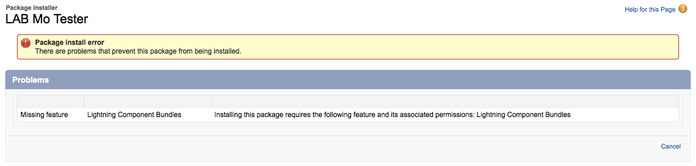
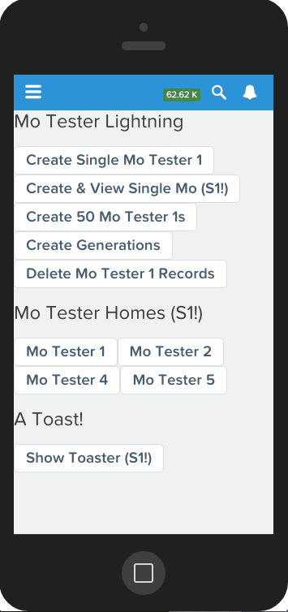

LAB-Mo-Tester
=============

[Unmanaged package for your developer edition](https://login.salesforce.com/packaging/installPackage.apexp?p0=04tE0000000IdF5).

Creates a toy data model and inserts sample data so you can experiment faster on the Force.com platform. Now includes:

* Simple Lightning Components
* A pre-configured Lightning Component Tab for your mobile navigation
* A simple Lightning Process that inserts Chatter posts immediately and an hour later.
* A Lightning Connect external data source under the LAB Mo External Data app.

This is not an app. This is more like lab equipment for your [developer edition](https://developer.salesforce.com/signup).  Questions? Suggestions? Issues? Hit the Twitter [@ReidCarlberg](http://twitter.com/ReidCarlberg).  

If you don't have a free Dev Org, [start by getting one here](http://developer.salesforce.com/signup).

**Note: The new version requires that you enable Lightning Components.  You might enjoy [Salesforce Lightning Component Newbie Notes](http://reidcarlberg.github.io/lightning-newbie) as well.**

Mo Tester is designed to make it easier for devs to try things out on the Salesforce Platform 
by providing a toy data model and light data.

Mo Tester was inspired by Steve Molis's comments on the [Button Click Admin](http://buttonclickadmin.com/) podcast. 
When asked how he tested things so quickly, he described a basic dev org pre-configured 
with an object with four of every kind of field. I smacked myself in the head and said 
we should all have one of those!

Note: [@ReidCarlberg](http://twitter.com/ReidCarlberg) put this together, and any weaknesses aren't [@SteveMoForce](http://twitter.com/SteveMoForce)'s fault. Thanks, Mr. Mo, for being a good sport about the name, and suggestions along the way!!

Thanks also to [Matthew Botos](http://twitter.com/BotosCloud) for the stupendous [SmartFactory](https://github.com/mbotos/SmartFactory-for-Force.com) code.

Did you find this helpful? Please tell a friend about it.

[Blog where I originally announced it.](http://blogs.developerforce.com/developer-relations/2013/03/experiment-faster-on-force-com.html)

Basic Data Model
================

Mo Tester 1: four of (almost) every kind of field.  One click data create from the list view.

-MT1 Child 1: A MD Relationship to Mo Tester 1.  Includes Date, Number, Picklist and Text fields. 

-MT1 Grandchild 1: An MD Relationship to MT Child 1.  Includes Date, Number, Picklist and Text fields. 

Mo Tester 2: one of (almost) every kind of field, Look Up relationship to Account.

MT1 MT4 Junction: junction object between Mo Tester 1 and Mo Tester 4. No other fields.

Mo Tester 4: includes 1 each of basic fields (checkbox, text, picklist, phone)

Mo Tester 5: includes 1 checkbox and 1 text field.  Mo Tester 1 has a Look Up relationship to Mo Tester 5.

Screenshots
===========

If you get this error, you haven't enabled Lightning Components in your org.

The Mo Tester Lightning page looks like this

